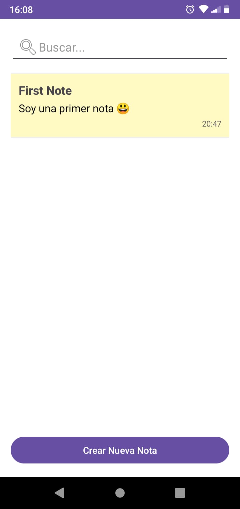
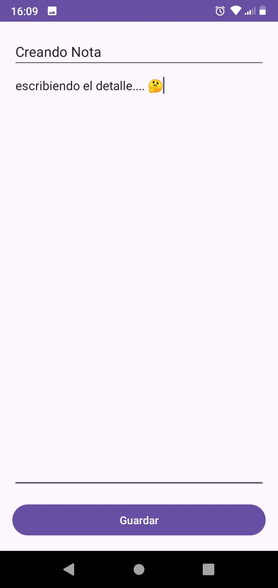
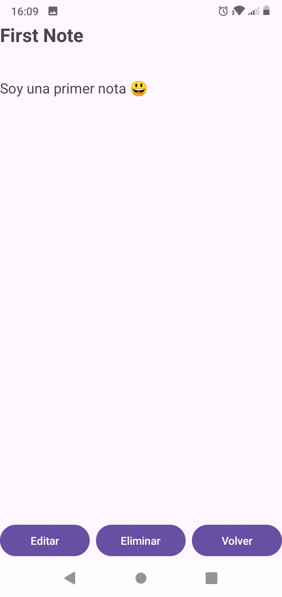
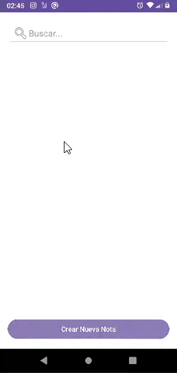

# 📒 Posticks

Una app sencilla para crear, visualizar y organizar notas de manera rápida e intuitiva.

## 📝 Descripción

**Posticks** es una aplicación Android desarrollada en Kotlin que permite a los usuarios crear notas, visualizarlas en una lista y ver el detalle de cada una. Está pensada para resolver el problema común de olvidar tareas o ideas, brindando una herramienta rápida para guardar todo lo que se nos cruce en el momento.

## 🛠️ Tecnologías utilizadas

- **Kotlin**
- **Android Studio**
- **Jetpack RecyclerView**
- **Git / GitHub**
- **View Binding**
- **Diseño con XML**

## ⚙️ Cómo compilar el proyecto

### Requisitos mínimos:

- Android Studio **Electric Eel o superior**
- SDK Android API **21 o superior**
- Gradle instalado (se gestiona automáticamente con Android Studio)
- Emulador o dispositivo físico con Android 5.0+

### Pasos:

1. Cloná el repositorio:  
   `git clone https://github.com/ValentinCarniel/Posticks`
2. Abrí el proyecto en Android Studio.
3. Esperá a que se sincronicen las dependencias de Gradle.
4. Ejecutá la app desde un emulador o dispositivo físico.
5. Cualquier duda ver seccion de comentarios..

## 💬 Comentarios

Aquí podés dejar notas o comentarios importantes:  
`https://github.com/ValentinCarniel/Posticks/issues`

## 📸 Capturas de pantalla

### 🏠 Pantalla principal

### 🗒️ Detalle de nota

### 🗒️ Acciones de cada nota

### 📌 Historial de cambios

- **fd55ba6** - Corrección en barra de búsqueda.
- **56d7be9** - Fusión de interfaces y funcionalidades.
- **fc8a332** - Actualización con datos de Facu.
- **1fda8f3** - Conflicto resuelto entre `pantallaDetalle` y `pantalla-inicio`.
- **cf1b94b** - Detalles agregados en pantalla de Cesar.
- **7218030** - Creación de pantalla de inicio.
- **f9b6a05** - Funcionalidad de crear/editar nota (Valen).
- **607aaf0** - Versión inicial del proyecto.

  ## 👥 Autores

- **Valentín CARNIEL** – [GitHub](https://github.com/ValentinCarniel)
- **César ALGARBE** – [GitHub](https://github.com/ALGARBE16)
- **Facundo VIDELA PRATS** – [GitHub](https://github.com/fvp55)
- **Mateo LIENDO** – [GitHub](https://github.com/mateVerde)
 
  

